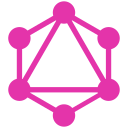

<h1 align="center">Hi 👋, I'm Mohamed Dhia Weslati</h1>
<h3 align="center" style>A passionate Full-Stack developer from Tunisia</h3>

---

 

- 🔭 I’m currently working **as a software development engineer at [Think It](https://www.think-it.io/)**

- 🌱 I’m currently learning **GoLang**

- 💬 Ask me about **Javascript, React, Redux, express, MongoDB**

- 📫 How to reach me **mohameddhia365@gmail.com**

- ⚡ Fun fact **I like philosophy but I'm a horrible writer 😅**

---

<table width="100%">
<tr>
<td width="60%">

&nbsp;

</td>
<td width="40%">

</td>
</tr>
</table>

---

---

:zap: Recent Activity

 
<!--START_SECTION:activity-->
1. ❗️ Closed issue [#108](https://github.com/lauripiispanen/most-active-github-users-counter/issues/108) in [lauripiispanen/most-active-github-users-counter](https://github.com/lauripiispanen/most-active-github-users-counter)
<!--END_SECTION:activity-->

